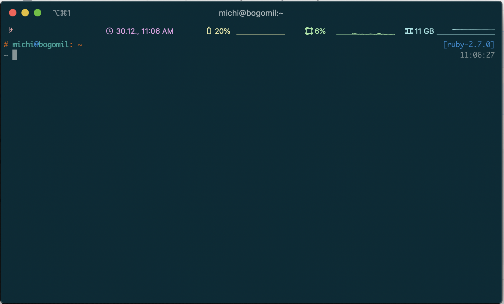

# zsh-bogo-theme
My theme for oh-my-zsh inspired by [zeta-zsh-theme](https://github.com/skylerlee/zeta-zsh-theme)

### Screenshot

<p align="center">
  
</p>

### Manually

1. Copy file `bogo.zsh-theme` to `$ZSH_CUSTOM/themes` folder.
2. Set theme to `zeta` in `~/.zshrc`:

```
ZSH_THEME="bogo"
```
## License

The MIT License.
